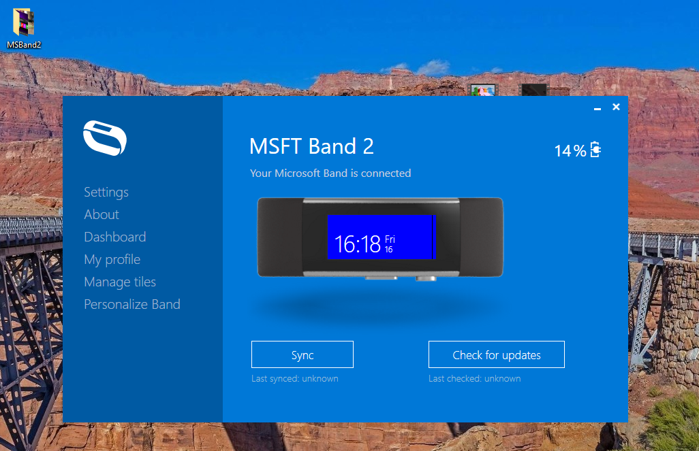
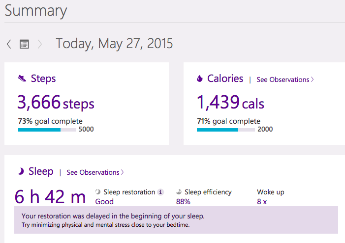

# MSBandDesktopApp

The official Microsoft Band desktop app, decompiled by [Pdawg](https://github.com/Pdawg-bytes) and "refurnished" by [m][e] :)

## My 2 cents

I tried to refactor the decompiled code. 

My main goal is achieve the state demonstated at screenshots.. oh... mockups! :)

## "Mockups" (the firm app running, not mine, heh!)

## My Little Progress

- Microsoft.Band +
- Microsoft.Band.Desktop +
- Microsoft.Band.Admin +
- Microsoft.Band.Admin.Desktop +
- Microsoft.Health.App.Core +
- Microsoft.Health.Cloud.Client +
- MicrosoftBandSyncApp +- (15 %)

## Bugs / Problems

The code structure of MicrosotBandDesktopApp is huge.

Too hard to refactor at my side... but I still plan to recover this great project. ^ ^

## Help / Dev. referencies

- https://sec.ch9.ms/ch9/895c/a0c52bca-7cd8-4e4c-b5ca-1563e9c4895c/DevelopingWindowsAppWithMSBands_mid.mp4
- https://sec.ch9.ms/ch9/79db/9a52a678-4415-4caa-860c-6a379b4779db/WebApplicationsMicrosoftHealthAPIs_mid.mp4
- https://sec.ch9.ms/ch9/895c/a0c52bca-7cd8-4e4c-b5ca-1563e9c4895c/DevelopingWindowsAppWithMSBands.webm
- https://sec.ch9.ms/ch9/895c/a0c52bca-7cd8-4e4c-b5ca-1563e9c4895c/DevelopingWindowsAppWithMSBands_high.mp4
- https://web.archive.org/web/20190516134940/http://developer.microsoftband.com/cloudAPI
- https://visualstudiomagazine.com/articles/2016/03/01/microsoft-band.aspx
- https://blogs.windows.com/devices/tag/microsoft-band/
- https://www.youtube.com/watch?v=pOI9uWGMNpI :: Microsoft Band 2 Review - 1,000 Miles Later

## ..

AS IS. No support. RnD only.

## .

[m][e] 2022
